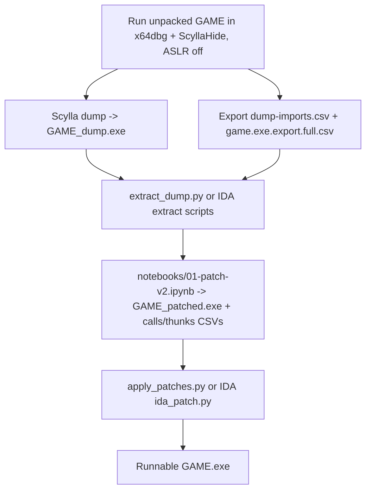

# patchingPE

Rebuild a **runnable `GAME.exe`** from a packed-game **memory dump**: restore the
import table and convert the packer's stolen call stubs (`90 E8 rel32`) back into
clean IAT calls (`FF 15 [thunk]`). The packed original (`GAME.exe`, ~9.9 MB,
2020-08-30) becomes a ~28 MB self-contained executable that no longer depends on
the runtime packer trampolines.

> The same idea is reused for `NeoMon.dll` under `fake_neomon_host/` +
> `neomon-dump/`. That is a **separate track** and is not needed to build GAME.exe.

## Setup (this machine)

```powershell
cd c:\Users\Svyat\Desktop\RE\TheGame\patchingPE
uv sync
```

`.env` (gitignored, machine-local — already set for this PC):

```env
BASE_TO_DUMPS=c:/Users/Svyat/Desktop/RE/TheGame   # parent of the patchingPE folder
BASE_TO_EXE=G:/Games/FA/FA-EMU/Shipping           # where GAME*.exe live
```

`BASE_TO_DUMPS` must be the **parent** of `patchingPE`: the IDA scripts append
`patchingPE/game-dump/...` to it. The notebook reads CSVs by relative path and
only uses `BASE_TO_EXE` to locate the binaries.

> `.venv` is bound to the machine that created it. After cloning/copying to a new
> PC, delete `.venv` and re-run `uv sync`.

## Pipeline (GAME.exe)



1. **Dump.** Unpacked process in x64dbg + ScyllaHide, ASLR disabled, run to a
   stable OEP. Scylla → dump → `GAME_dump.exe`. Do **not** "Fix dump"/rebuild IAT
   in Scylla — imports are rebuilt in Python.
2. **Export symbols** (while attached), into `game-dump/`:
   - `dumps/dump-imports.csv` (x64dbg symbols export)
   - `game.exe.export.full.csv` (per-module export list, **decorated** names)
3. **Extract from `GAME_dump.exe`** (standalone CLI **or** IDA scripts):
   - **Standalone (recommended):** `scripts/standalone/extract_dump.py` → `old-iat.csv` + `broken-byte-calls.csv`
   - **IDA:** `scripts/extract-old-iat.py` + `scripts/extract-byte-calls.py` (same outputs)
   - Expect **~37k** rows in `broken-byte-calls.csv` on a good dump (~14k means the dump is incomplete — re-dump in Scylla).
4. **`notebooks/01-patch-v2.ipynb`** top-to-bottom:
   - joins live IAT addresses with export metadata,
   - rebuilds the import directory (LIEF) → `GAME_patched.exe`,
   - fixes `FirstThunk` RVAs (pefile),
   - writes `game-dump/patches/calls_patch.csv` (~31k) and `thunks_patch.csv` (~924).
5. **Apply patch CSVs to `GAME_patched.exe`** (standalone **or** IDA):
   - **Standalone:** `scripts/standalone/apply_patches.py` → writes patched exe on disk
   - **IDA:** `scripts/ida_patch.py`, then **Edit → Patch program → Apply patches to input file**
   - Good build: `--count` shows **~31k `FF 15`** and **~200 `90 E8`** in section 0 (not ~29k `90 E8`).
6. **Validate** (optional): `uv run python scripts/validate_imports.py "<exe>"`.
7. **Ctl / in-game hooks:** use `GAME_patched_dll.exe` (adds `TheGame.dll` import `"A"`) and copy to `BASE_TO_EXE` as `GAME.exe`; launch via `just ctl launch` from [`../ctl`](../ctl).

### Standalone pipeline (no IDA)

```powershell
cd c:\Users\Svyat\Desktop\RE\TheGame\patchingPE

# 1. Extract (after x64dbg dump + symbol CSVs exist)
uv run python scripts/standalone/extract_dump.py `
  -i "$env:BASE_TO_EXE/GAME_dump.exe" `
  -o game-dump/dumps --kind exe

# 2. Notebook (unchanged)
#    notebooks/01-patch-v2.ipynb -> GAME_patched.exe + patches/*.csv

# 3. Apply patches (+ optional TheGame.dll import -> GAME_patched_dll.exe)
uv run python scripts/standalone/apply_patches.py `
  -i game-dump/GAME_patched_dll.exe `
  -p game-dump/patches `
  -o game-dump/GAME_patched_applied.exe
```

**Dead sections:** keep `wlovhtaq` and `oemvvlbu` in the image (layout only). Comparison tools ignore them; post-reboot byte diffs there are normal.

## Scripts

| Script | Where it runs | Purpose |
|---|---|---|
| `scripts/extract-old-iat.py` | IDA (dump) | Dump old IAT slot values → `old-iat.csv` |
| `scripts/extract-byte-calls.py` | IDA (dump) | Find packer `90 E8`/`90 E9` stub calls |
| `scripts/extract-analyzed-calls.py` | IDA (dump) | Optional; notebook clears this input |
| `scripts/ida_patch.py` | IDA (patched) | Apply `calls_patch.csv` + `thunks_patch.csv` |
| `scripts/validate_imports.py` | uv (CLI) | Check each import resolves against its DLL's exports |
| `scripts/compare_game_exes.py` | uv (CLI) | Diff two builds (headers/imports/bytes/call-sites) |
| `scripts/compare_patched_builds.py` | uv (CLI) | IAT slots, patch coverage, stub scan, reboot diff |
| `scripts/standalone/extract_dump.py` | uv (CLI) | Unified old-IAT + byte-call extract |
| `scripts/standalone/apply_patches.py` | uv (CLI) | Apply `calls_patch.csv` + `thunks_patch.csv` |
| `scripts/standalone/pe_rva.py` | imported | VA/file-offset helpers |
| `notebooks/01-patch-v2.ipynb` | Jupyter | Rebuild imports + generate patch CSVs |
| `notebooks/addr_helpers.py` | imported | LE/rel-call byte helpers for the notebook |

## Comparing builds / debugging a non-runnable copy

`scripts/compare_game_exes.py` exists to answer "why does build X run but build Y
crash":

```powershell
uv run python scripts/compare_game_exes.py "<A.exe>" "<B.exe>"            # headers/sections/imports
uv run python scripts/compare_game_exes.py "<A.exe>" "<B.exe>" --count    # 90 E8 vs FF 15 call-sites
uv run python scripts/compare_game_exes.py "<A.exe>" "<B.exe>" --bytes    # per-section byte diff (same size)
uv run python scripts/compare_game_exes.py "<A.exe>" "<B.exe>" --classify # bucket differing dwords by addr range
```

**Known finding (2026-05):** a build dumped/patched on another PC crashed on
startup here. `--count` showed it had **28,681 unpatched `90 E8` packer stubs**
vs **31,465 `FF 15` IAT calls** in the good build — i.e. step 5 (patch apply)
was never applied. Those stubs embed absolute addresses from the *dumping*
machine's process memory and are not portable.

**Local `game-dump/` diagnosis (2026-05-31):** `compare_patched_builds.py` against
`game-dump-remote/` showed:

| Check | Local | Remote (good CSVs) |
|-------|-------|------------------|
| `broken-byte-calls.csv` (standalone extract) | **~14.2k** rows | **~37.2k** rows |
| Patch sites in CSVs | **11,780** | **31,699** |
| Remote-only sites still `90 E8` on local exe | **19,919** | — |
| `GAME_patched_dll.exe` before apply (`90 E8` / `FF 15`) | 28,681 / 2,939 | same (notebook-only stage) |

Root cause on this PC: **`GAME_dump.exe` is missing most packer stubs** (re-dump in
x64dbg), not a bad IAT layout (`old-iat.csv` slot count matches). After a full dump,
re-run extract → notebook → `apply_patches.py`.

```powershell
uv run python scripts/compare_patched_builds.py `
  game-dump/GAME_patched_dll.exe game-dump-remote/GAME_patched_dll.exe `
  --patches-a game-dump/patches --remote-patches game-dump-remote/patches `
  --out-dir game-dump/compare

# Reboot / far-jump delta (ignore wlovhtaq + oemvvlbu)
uv run python scripts/compare_patched_builds.py `
  game-dump-remote/GAME_patched_dll.exe game-dump-remote-2/GAME_patched_dll.exe `
  --reboot-diff
```

`game-dump-remote-2/GAME_patched_dll.exe` is the **fully applied** reference
(~31410 `FF 15`, ~209 `90 E8` after patch apply).

### Reboot / IAT mapping verification

`scripts/reboot_iat_map.py` compares **unapplied** vs **fully patched** builds and
checks every row in `calls_patch.csv` + `thunks_patch.csv`:

```powershell
uv run python scripts/reboot_iat_map.py `
  --before game-dump-remote/GAME_patched_dll.exe `
  --after game-dump-remote-2/GAME_patched_dll.exe `
  --patches-dir game-dump-remote/patches `
  --old-iat game-dump-remote/dumps/old-iat.csv `
  --dump-imports game-dump-remote/dumps/dump-imports.csv
```

**2026-05-31 results (remote vs remote-2):**

| Check | Result |
|-------|--------|
| Patch sites stub→`FF15`/`FF25` | **31,733 / 31,733** (incl. `0x61fffa` integrity exception left as `90E8`) |
| IAT slot *values* in file | **877 / 923** differ (reboot dump addresses — loader re-binds at run time) |
| Code sections 0–1 (IAT bytes zeroed) | **Identical** between remote-2 and freshly `apply_patches` on this PC |
| Unlisted `90E8`→sysdll | **2** sites (`0x798465`, `0x117fc65`) — dest not in `old-iat.csv`, absent from patch CSV on both machines |

**Portability check:** applying `game-dump-remote/patches` to
`game-dump-remote/GAME_patched_dll.exe` on this PC yields a file **byte-identical**
to `game-dump-remote-2/GAME_patched_dll.exe` in code (see `--compare-code` in
`reboot_iat_map.py`). Copy that exe to `BASE_TO_EXE` as `GAME.exe` for ctl.

```powershell
uv run python scripts/standalone/apply_patches.py `
  -i game-dump-remote/GAME_patched_dll.exe `
  -p game-dump-remote/patches `
  -o game-dump-remote/GAME_patched_applied.exe
Copy-Item game-dump-remote/GAME_patched_applied.exe G:/Games/FA/FA-EMU/Shipping/GAME.exe
```

## Layout

```
scripts/              IDA + CLI tools (above)
scripts/standalone/   extract_dump.py, apply_patches.py, pe_rva.py
notebooks/            01-patch-v2.ipynb (+ addr_helpers.py)
game-dump/            GAME.exe inputs/outputs: dumps/, patches/, compare/
.env                  machine-local paths (gitignored)
```
