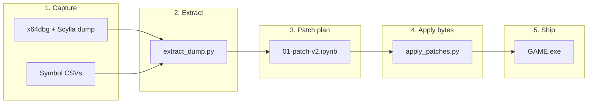

# patchingPE

Turn a **packed GAME memory dump** into a **runnable `GAME.exe`**: rebuild the import directory and replace packer call stubs (`90 E8 rel32` → hard-coded DLL addresses) with normal IAT indirect calls (`FF 15 [slot]`).

The packed retail binary (~10 MB) becomes a ~28 MB dump-based build that does not depend on runtime packer trampolines.

## What you need


| Requirement         | Notes                                                                                      |
| ------------------- | ------------------------------------------------------------------------------------------ |
| **Windows**         | Target is Win32 PE.                                                                        |
| **Python 3.12+**    | Managed with [uv](https://github.com/astral-sh/uv).                                        |
| **x64dbg + Scylla** | Dump the **unpacked** process; do not use Scylla “Fix dump” / IAT rebuild.                 |
| **Symbol CSVs**     | `dump-imports.csv` and `game.exe.export.full.csv` from the same debug session as the dump. |
| **Optional: IDA**   | Legacy path only; standalone scripts are preferred.                                        |


## Setup

```powershell
cd c:\Users\Svyat\Desktop\RE\TheGame\patchingPE
uv sync
```

Create `.env` in this folder (gitignored):

```env
BASE_TO_DUMPS=c:/Users/Svyat/Desktop/RE/TheGame
BASE_TO_EXE=G:/Games/FA/FA-EMU/Shipping
```

- `BASE_TO_EXE` — where `GAME_dump.exe` lives and where the notebook writes `GAME_patched.exe`.
- `BASE_TO_DUMPS` — parent of `patchingPE` (only needed for legacy IDA scripts that write under `patchingPE/game-dump/...`).

After cloning on a new PC, delete `.venv` and run `uv sync` again.

## End-to-end patch (GAME.exe)

High-level flow:




### Step 0 — Dump in x64dbg

1. Run the unpacked game with **ScyllaHide**, **ASLR off**, to a stable point (past packer / at OEP).
2. **Scylla → Dump** → save as `GAME_dump.exe` under `BASE_TO_EXE` (or copy into `game-dump/`).
3. Do **not** use Scylla “Fix dump” or rebuild the IAT — Python does that later.
4. While still attached, export into `game-dump/`:
  - `dumps/dump-imports.csv` — resolved symbols from the debugger.
  - `game.exe.export.full.csv` — per-module exports (**decorated** names).

A good dump is ~28 MB and contains the full unpacked image. A thin dump produces too few stub rows in step 1 (see [Troubleshooting](#troubleshooting)).

### Step 1 — Extract IAT + stub calls

```powershell
cd c:\Users\Svyat\Desktop\RE\TheGame\patchingPE

uv run python scripts/standalone/extract_dump.py `
  -i "$env:BASE_TO_EXE/GAME_dump.exe" `
  -o game-dump/dumps `
  --kind exe `
  --dump-imports game-dump/dumps/dump-imports.csv
```

**Writes**


| File                                    | Purpose                                                  |
| --------------------------------------- | -------------------------------------------------------- |
| `game-dump/dumps/old-iat.csv`           | IAT slot VA → pointer value at dump time (~923 rows).    |
| `game-dump/dumps/broken-byte-calls.csv` | Packer `90 E8` / `90 E9` / … sites → absolute target VA. |


**Sanity check:** `broken-byte-calls.csv` should have **~40k+** rows on a full dump (after the mid-range bounds fix). **~14k** usually means the dump is incomplete — re-dump in Scylla.

Scans PE sections **0 and 1** only (code + `.rsrc` tail patterns). Packer filler sections `wlovhtaq` / `oemvvlbu` are left as layout; ignore byte noise there.

### Step 2 — Rebuild imports and generate patch CSVs

Run the notebook top to bottom:

- **UI:** open `notebooks/01-patch-v2.ipynb` → Run All.
- **CLI:**

```powershell
uv run python -m jupyter nbconvert `
  --to notebook --execute notebooks/01-patch-v2.ipynb `
  --output 01-patch-v2.ipynb `
  --ExecutePreprocessor.timeout=900
```

The notebook:

1. Joins `old-iat.csv`, `broken-byte-calls.csv`, and export metadata.
2. Copies `GAME_dump.exe` → `BASE_TO_EXE/GAME_patched.exe`.
3. Rebuilds the import directory (LIEF) and fixes thunk RVAs (pefile).
4. Writes patch plans under `game-dump/patches/`:
  - `calls_patch.csv` — stub calls/jmps → `FF 15` / `FF 25` (~31k rows).
  - `thunks_patch.csv` — `90 E9` thunk slots (~924 rows).

**Output binary at this stage is not finished** — it still contains thousands of `90 E8` stubs until step 3.

### Step 3 — Apply patch bytes

```powershell
uv run python scripts/standalone/apply_patches.py `
  -i "$env:BASE_TO_EXE/GAME_patched.exe" `
  -p game-dump/patches `
  -o game-dump/GAME_patched.exe
```

Use `-i` / `-o` on the same file with `--in-place` if you prefer overwriting `GAME_patched.exe` in Shipping directly.

**Example:** a NeoMon stub site that used to `call` a fixed VA like `0x108011b0` becomes `FF 15` through IAT slot `0x15888E0` (see `calls_patch.csv` row at `0xa0f2f0`).

### Step 4 — Verify

```powershell
uv run python scripts/compare_game_exes.py `
  game-dump/GAME_dump.exe `
  game-dump/GAME_patched.exe `
  --count
```


| Metric                       | Dump (`GAME_dump.exe`) | Good patched build |
| ---------------------------- | ---------------------- | ------------------ |
| `90 E8` (packer stub calls)  | ~29k                   | **~150–250**       |
| `FF 15` (IAT indirect calls) | ~3k                    | **~31k**           |


If `90 E8` is still ~29k, step 3 was skipped or patch CSVs do not match the dump.

Optional:

```powershell
uv run python scripts/validate_imports.py game-dump/GAME_patched.exe
```

### Step 5 — Deploy for play / hooks

```powershell
Copy-Item game-dump/GAME_patched.exe "$env:BASE_TO_EXE/GAME.exe"
```

For FA-EMU reimplementation work, launch via the game controller from the parent repo (`just ctl::launch-offline`, etc.). See `[../controller/README.md](../controller/README.md)`.

---

## One-shot command list

Assumes `.env` is loaded and symbol CSVs already exist under `game-dump/`.

```powershell
uv sync

# 1 — extract
uv run python scripts/standalone/extract_dump.py `
  -i "$env:BASE_TO_EXE/GAME_dump.exe" `
  -o game-dump/dumps --kind exe `
  --dump-imports game-dump/dumps/dump-imports.csv

# 2 — notebook (imports + patch CSVs + GAME_patched.exe skeleton)
uv run python -m jupyter nbconvert `
  --to notebook --execute notebooks/01-patch-v2.ipynb `
  --output 01-patch-v2.ipynb `
  --ExecutePreprocessor.timeout=900

# 3 — apply bytes
uv run python scripts/standalone/apply_patches.py `
  -i "$env:BASE_TO_EXE/GAME_patched.exe" `
  -p game-dump/patches `
  -o game-dump/GAME_patched.exe

# 4 — verify + deploy
uv run python scripts/compare_game_exes.py `
  game-dump/GAME_dump.exe game-dump/GAME_patched.exe --count
Copy-Item game-dump/GAME_patched.exe "$env:BASE_TO_EXE/GAME.exe"
```

## Artifacts layout

```
game-dump/
  GAME_dump.exe              # optional local copy of dump
  game.exe.export.full.csv   # module exports (input)
  dumps/
    dump-imports.csv         # debugger symbols (input)
    old-iat.csv              # extract step
    broken-byte-calls.csv    # extract step
  patches/
    calls_patch.csv          # notebook → apply step
    thunks_patch.csv
  GAME_patched.exe           # final applied build (local)
```

`BASE_TO_EXE/GAME_dump.exe` and `BASE_TO_EXE/GAME_patched.exe` are the paths the notebook uses by default.

## IDA path (legacy)

Same logic as standalone, inside IDA on `GAME_dump.exe`:


| Script                          | Output                  |
| ------------------------------- | ----------------------- |
| `scripts/extract-old-iat.py`    | `old-iat.csv`           |
| `scripts/extract-byte-calls.py` | `broken-byte-calls.csv` |


Then notebook → `scripts/ida_patch.py` on `GAME_patched.exe` → **Edit → Patch program → Apply patches to input file**.

`extract-byte-calls.py` and `standalone/extract_dump.py` share the same `check_in_bounds_game` filter (including NeoMon / module VA band `0x10000000`–`0x5DD00000`).

## Troubleshooting

### Build crashes on startup (access violation in unmapped VA)

Typical pattern: `call rel32` still targets a **fixed stub VA** from the dumping machine (e.g. `0x108011b0`) instead of going through the IAT.

- Confirm the site is in `broken-byte-calls.csv` and `calls_patch.csv`.
- Confirm step 3 was run and `--count` shows ~31k `FF 15`, not ~29k `90 E8`.

### `broken-byte-calls.csv` too small (~14k rows)

The dump is missing most code sections or was taken too early. Re-dump with Scylla; keep ASLR off; use the same session for symbol exports.

### Notebook fails: `lief.PE.parse` returns `None`

Run the notebook with the project venv (`uv run python -m jupyter …`), not a system Jupyter install. Passing a `Path` to LIEF is fine on 3.12 when the kernel is the venv Python.

### Patched exe from another PC does not run here

Packer stubs embed **absolute VAs from the dumper’s address space**. You must extract + patch from **your** `GAME_dump.exe`, or ship the fully applied binary produced on the machine that created the dump.

### Compare / deep diagnosis

```powershell
# Quick stub vs IAT ratio
uv run python scripts/compare_game_exes.py "<A.exe>" "<B.exe>" --count

# Patch coverage vs reference tree
uv run python scripts/compare_patched_builds.py `
  game-dump/GAME_patched.exe game-dump-remote-2/GAME_patched.exe `
  --patches-a game-dump/patches --remote-patches game-dump-remote/patches `
  --out-dir game-dump/compare

# Reboot IAT slot drift (expected) vs missed patch sites (bad)
uv run python scripts/reboot_iat_map.py `
  --before game-dump-remote/GAME_patched.exe `
  --after game-dump-remote-2/GAME_patched.exe `
  --patches-dir game-dump-remote/patches `
  --old-iat game-dump-remote/dumps/old-iat.csv `
  --dump-imports game-dump-remote/dumps/dump-imports.csv
```

## Scripts reference


| Script                                         | Role                                                 |
| ---------------------------------------------- | ---------------------------------------------------- |
| `scripts/standalone/extract_dump.py`           | **Step 1** — `old-iat.csv` + `broken-byte-calls.csv` |
| `scripts/standalone/apply_patches.py`          | **Step 3** — apply CSV bytes to PE                   |
| `scripts/standalone/pe_rva.py`                 | VA ↔ file offset helpers                             |
| `notebooks/01-patch-v2.ipynb`                  | **Step 2** — imports + patch CSVs                    |
| `notebooks/addr_helpers.py`                    | Hex / rel32 helpers for notebook                     |
| `scripts/compare_game_exes.py`                 | Headers, imports, `--count`, byte diff               |
| `scripts/compare_patched_builds.py`            | Cross-machine patch coverage                         |
| `scripts/reboot_iat_map.py`                    | Patch-site audit vs reference build                  |
| `scripts/validate_imports.py`                  | Import name vs export table check                    |
| `scripts/extract-*.py`, `scripts/ida_patch.py` | IDA equivalents                                      |


## Other tracks

- **NeoMon.dll** — same packer-stub idea under `fake_neomon_host/` + `neomon-dump/`; not required for GAME.exe.
- **Historical notes** — see `README-old.md` for older diagnosis write-ups (remote compare tables, reboot verification logs).

