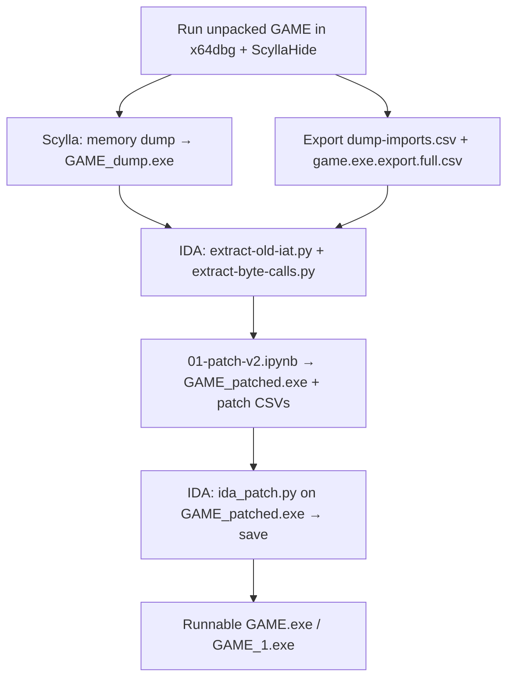

# Creating runnable GAME.exe from memory dump
_Exported on 5/31/2026 at 00:04:26 GMT+3 from Cursor (3.2.11)_

---

**User**

This repo should produce the runnable GAME.exe from memory dump, but i just can't remember how (i wrote this half a year ago). I have the runnable GAME.exe is located at C:\Games\FA-EMU\Shipping\GAME_1.exe, so you can compare the creation date and maybe hash.

---

**Cursor**

Tracing the repo workflow and comparing it to your reference `GAME_1.exe`.


Here is the workflow your repo implements, reconstructed from `01-patch-v2.ipynb`, the IDA scripts, and your reference binary.

## What your `GAME_1.exe` actually is

| File | Size | Last write | SHA-256 |
|------|------|------------|---------|
| `GAME.exe` (original, packed) | 9,968,864 | 2020-08-30 | — |
| `GAME_patched.exe` | 28,782,592 | 2025-11-04 | `A6ABE686…` |
| **`GAME_1.exe` (your good one)** | **28,783,448** | **2025-11-09** | **`390353D4…`** |

`GAME_1.exe` and `GAME_patched.exe` are effectively the same build: all PE sections match byte-for-byte (including `.text` with ~31k call patches). The 856-byte size gap is only headers/padding (`SizeOfImage` differs slightly). A spot-check at `0x1003caf` shows the patched `FF15 …` IAT call in both.

So **`GAME_1.exe` ≈ `GAME_patched.exe` after the full pipeline** (likely renamed or re-saved from IDA on Nov 9).

`GAME_dump.exe` is not in Shipping anymore; you would need a fresh Scylla dump to redo from scratch.

---

## End-to-end pipeline (GAME.exe)



### 0. Setup

```bash
cd c:\Users\sstnd\Desktop\RE\patchingPE
uv sync
```

Create `.env` in the repo root (gitignored):

```env
BASE_TO_EXE=C:/Games/FA-EMU/Shipping
BASE_TO_DUMPS=C:/Users/sstnd/Desktop/RE
```

(`BASE_TO_DUMPS` must be the parent of the `patchingPE` folder — IDA scripts append `/patchingPE/game-dump/...`.)

### 1. Debugger: get the memory dump

Same idea as the NeoMon notebooks (`patch-dll-v4.ipynb` “Before starting” block), but for **GAME.exe**:

1. Run FA-EMU / attach **x64dbg** with **ScyllaHide**.
2. **Disable ASLR** for `GAME.exe`.
3. Run until the binary is **unpacked** (stable OEP / past Themida or whatever you used before).
4. **Scylla** → dump process → save as  
   `C:\Games\FA-EMU\Shipping\GAME_dump.exe`  
   **Do not** “Fix dump” / rebuild IAT in Scylla (you rebuild imports in Python).

### 2. Debugger: export symbol CSVs (while still attached)

Into `patchingPE/game-dump/`:

| Output | x64dbg source |
|--------|----------------|
| `dumps/dump-imports.csv` | Symbols export |
| `game.exe.export.full.csv` | Module → list exports (for `game.exe`) |

These are **not** in git right now; you need them (or copies from your old session) for a full re-run.

### 3. IDA on `GAME_dump.exe`

Run (File → Script file…):

- `scripts/extract-old-iat.py` → `game-dump/dumps/old-iat.csv` (IAT VA range `0x1588000`–`0x1588E6C`)
- `scripts/extract-byte-calls.py` → `game-dump/dumps/broken-byte-calls.csv` (obfuscated `90 E8` / `90 E9` patterns)

`extract-analyzed-calls.py` exists but the notebook clears that input (`calls_inst = ...clear()`), so it is optional.

### 4. Notebook: rebuild imports + generate patch tables

Run **`notebooks/01-patch-v2.ipynb`** top to bottom.

It:

1. Joins live addresses (`dump-imports.csv`) with export metadata (`game.exe.export.full.csv`).
2. Rebuilds the import directory with **LIEF** → `GAME_patched.exe`.
3. Fixes `FirstThunk` RVAs with **pefile** (keeps the old IAT VA layout).
4. Writes ~31k call patches + ~924 thunk patches to  
   `game-dump/patches/calls_patch.csv` and `thunks_patch.csv`.

### 5. IDA on `GAME_patched.exe`

1. Open `GAME_patched.exe` in IDA.
2. Run `scripts/ida_patch.py` (applies both CSVs from `game-dump/patches/`).
3. **Edit → Patch program → Apply patches to input file** (or your usual “produce EXE” flow) and save.

That saved file is your runnable ~28 MB exe (`GAME_1.exe` in practice).

### 6. Optional checks

```bash
uv run python scripts/validate_imports.py C:\Games\FA-EMU\Shipping\GAME_patched.exe
```

`make_decorated_map.ipynb` / `make_decorated_map_from_csv.ipynb` build `names-map.csv` for decorated↔undecorated names; **`01-patch-v2` does not use them** — it expects **decorated** names in `game.exe.export.full.csv`.

---

## What is already in the repo vs what you must redo

**Present** (from your last successful run):

- `game-dump/dumps/old-iat.csv`, `broken-byte-calls.csv`
- `game-dump/patches/calls_patch.csv`, `thunks_patch.csv`

**Missing** (needed for a full fresh run):

- `GAME_dump.exe`
- `game-dump/dumps/dump-imports.csv`
- `game-dump/game.exe.export.full.csv`

**Fast path if you only need a runnable exe again:**  
If `GAME_patched.exe` still runs, copy/rename it — it already matches `GAME_1.exe` in all sections. You only need the full pipeline again after a **new** memory dump or game build.

---

## Parallel track (not GAME)

`patch-dll-v4.ipynb` + `neomon-dump/` + `fake_neomon_host/` is the **NeoMon.dll** workflow (host `host-bind.exe`, OEP `0x10013903`, etc.) — separate from GAME.exe.

I can add a short `README.md` with this checklist in the repo, or walk through re-creating the missing CSVs from x64dbg step-by-step, if you want that next.

